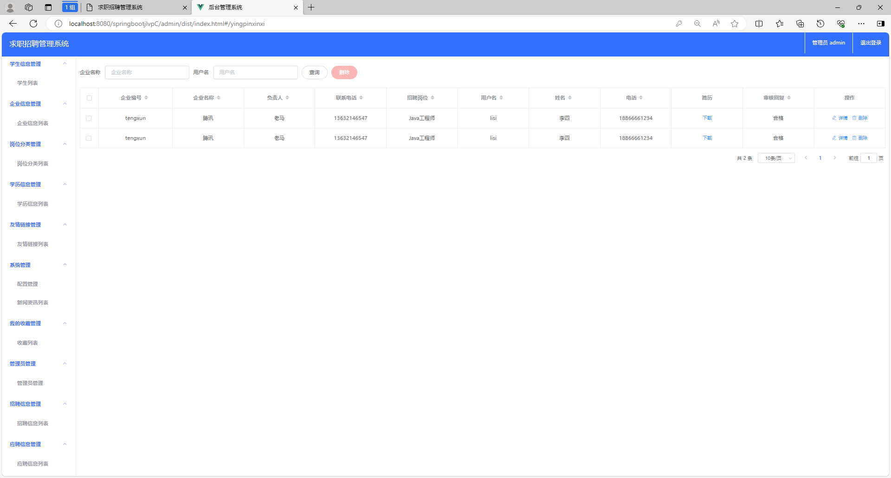

# 求职招聘管理系统

### 9.9￥ 获取完整源码+sql，需要加Q：3808981644  或者加微信 ：qszard26
### 有问题，或者需要协助调试运行项目的也可联系
### 获取更多项目，关注公众号：编程项目集

## 一、项目介绍

开发语言：java

运行环境:idea或eclipse 数据库:mysql

三个角色：管理员、企业、求职者

前端技术：Vue.js、ElementUI、HTML、CSS、JS、Jquery

后端技术：SpringBoot、Mybatis

[1]管理员：登录、个人中心、学生信息管理、企业信息管理、岗位分类管理、学历信息管理、友情链接管理、新闻资讯管理、收藏管理、招聘信息管理、应聘信息管理、求职者信息管理

[2]企业：注册、登录、个人信息管理、招聘信息管理、应聘信息管理

[3]学生：注册、登录、招聘信息、求职者信息、投递简历、友情链接、留言板、个人中心、后台管理、新闻资讯

## 二、部分功能界面展示

### 9.9￥ 获取完整源码+sql，需要加Q：3808981644  或者加微信 ：qszard26
### 有问题，或者需要协助调试运行项目的也可联系

